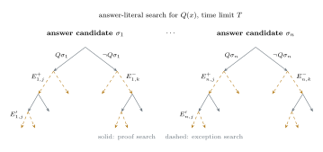

# GK Reasoner

GK is a first-order reasoner for knowledge bases containing uncertain facts,
default rules, exceptions, and contradictions. It returns proofs and verdict
confidences, and can provide a detailed support assessment for each answer.
GK uses non-ground first-order resolution and supports function terms,
equality, classical disjunction, and explicit negation.

GK extends the resolution prover [GKC](https://github.com/tammet/gkc) with:

- confidence annotations on facts and rules;
- provenance-aware combination of retained proofs, accounting for shared
  ground activation events;
- separate treatment of positive and negative support for a conclusion;
- default rules whose exceptions are checked by subsidiary proof searches;
- numeric priorities and taxonomy-based priorities for competing defaults;
- four-component reports of positive support, negative support, conflict, and
  ignorance;
- shared-memory reuse of a fixed axiom set across queries (native builds);
- concurrent execution of automatically selected search strategies (Unix).

A live web version of GK, with examples and documentation, runs in the browser
at [https://logictools.org/commonsense.html](https://logictools.org/commonsense.html);
no installation is needed.

## Running GK

Prebuilt binaries for Linux x86-64, macOS on Apple silicon, Windows x64, and
WebAssembly are in `bin/`. On Linux:

```sh
chmod +x bin/gk
./bin/gk Examples/exceptions/penguin.gkp
```

The command returns the ordinary bird `b` as flying and rejects the penguin
`p`. Taxonomy-based default priorities load their data from
[`data/`](data/README.md):

```sh
./bin/gk Examples/exceptions/classify.gkp -taxonomy -datafolder data
```

Run `./bin/gk -help` for the option summary. The native binaries use the
same command-line interface; the WebAssembly build has the limits described
in [`bin/README.md`](bin/README.md), which also covers the other platforms,
the browser build, and where the binaries come from.

## Example

`Examples/exceptions/penguin.gkp` contains:

```prolog
bird(b).
penguin(p).

bird(X)   :- penguin(X).
object(X) :- bird(X).
-flies(X) :- penguin(X).

flies(X)  :- bird(X),   unless(-flies(X), 3).
-flies(X) :- object(X), unless(flies(X), 2).

query(flies(X)).
```

The priority-3 bird default derives `flies(b)`. The lower-priority object
default does not defeat it. The strict penguin rule derives `-flies(p)`, so
`p` is rejected as an answer to `flies(X)`. Abridged output:

```text
answer: b
confidence: 1

rejected answer: p
confidence against: 1
```

## Search structure

For a query Q(x), an answer-literal search with the overall time limit T
discovers candidate answer substitutions σ<sub>1</sub>, …, σ<sub>n</sub>.
For each candidate σ<sub>i</sub>, GK collects proofs of the query instance
Qσ<sub>i</sub> and, separately, proofs of its explicit negation
¬Qσ<sub>i</sub>. A blocker literal found in either collection starts a
bounded subsidiary search for its exception condition — labelled
E<sup>+</sup><sub>i,j</sub> in the positive collection and
E<sup>−</sup><sub>i,k</sub> in the negative one — with a smaller time limit
T<sub>1</sub>; an exception E′ nested inside such a check gets a still
smaller limit T<sub>2</sub> < T<sub>1</sub>. Candidate and proof searches
continue after the first substitution and the first proof.



Solid branches are proof searches; dashed branches are exception searches.
In the penguin example above, `b` and `p` are the two answer candidates,
the `flies` proofs form the positive collection, the `-flies` proofs the
negative one, and the `unless` conditions are checked by the subsidiary
searches.

## Input formats

GK accepts four input notations:

| Notation | Typical suffix | Purpose |
|---|---|---|
| GKP | `.gkp`, `.pl`, `.pro`, `.prolog` | Prolog-style notation for hand-written problems |
| JSON-LD-LOGIC | `.js` | Native representation |
| GKS | `.gks` | Premise-to-consequence notation using `=>` |
| TPTP CNF | `.p`, `.ax`, `.tptp`, `.cnf` | Clause-normal-form problems and interchange |

The formats and their correspondence are described by examples in
[`Doc/input_languages.md`](Doc/input_languages.md).

## English-language reasoning

The
[llmpipe commonsense-reasoning system](https://github.com/tammet/nlpsolver/tree/main/llmpipe)
automatically translates English into GK logic and uses GK as its reasoning
engine. The resulting logic and runnable examples are described in
[`Examples/language/`](Examples/language/README.md). The
[nlformtasks collection](https://github.com/tammet/nlformtasks) provides a
larger set of language-translation examples runnable by GK.

## Documentation

| Document | Contents |
|---|---|
| [`Examples/README.md`](Examples/README.md) | Tutorial based on runnable examples |
| [`Doc/input_languages.md`](Doc/input_languages.md) | Facts, rules, queries, defaults, and confidence annotations in each notation |
| [`Doc/how_gk_works.md`](Doc/how_gk_works.md) | Resolution, input confidences, proof support, signed confidence, verdict confidence, contradictions, and defaults |
| [`Doc/cli_reference.md`](Doc/cli_reference.md) | Command-line options |
| [`Doc/strategy_reference.md`](Doc/strategy_reference.md) | Automatic search and strategy files |
| [`Doc/comparison_with_other_systems.md`](Doc/comparison_with_other_systems.md) | Comparisons with other reasoners |
| [`Examples/language/README.md`](Examples/language/README.md) | Logic generated from English-language inputs |
| [`montecarlo/README.md`](montecarlo/README.md) | Sampling comparisons for the ground-instance activation and shared-threshold interpretations |
| [`comparisons/README.md`](comparisons/README.md) | Inputs, classifications, and captured outputs for the implemented-system comparison table |

## Repository layout

```text
bin/          GK executables for each platform
data/         taxonomy data for -taxonomy, with its builder
Doc/          user documentation
Examples/     example problems grouped by feature
montecarlo/   sampling comparisons for the activation and threshold interpretations
comparisons/  comparison table inputs, classifications, and outputs
```

The example categories are classical reasoning, confidence and support calculation,
defaults and exceptions, arithmetic, proof-search strategy, and
natural-language reasoning.

## Development

GK is developed by Tanel Tammet, with database technology contributions by
Priit Järv and conceptual ideas by Tanel Tammet, Priit Järv, and Dirk Draheim.
